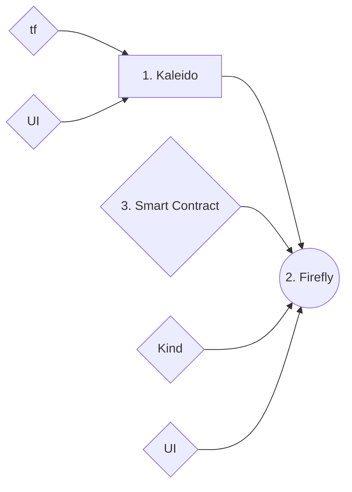

# Kaleido Project

## Workflow

## Approach

> **Prerequisites:** 
> kind
> ff cli
> helm 
> ct
> golang
> kubectl
> tf

#### Kaleido Blockchain
From the above flow chart we see the 3 major components of this project. 
For step 1, we can use **Kaleido** web UI to set up the ethereum blockchain with the help of the [Quick-start-etherum](https://docs.kaleido.io/using-kaleido/quick-start-ethereum/) guide. 
The ideal approach would be to use terraform to automate the steps in the above, for which the initial base configuration can be found at the repo [terraform-provider-kaleido](https://github.com/kaleido-io/terraform-provider-kaleido).
My initial approach was to understand the basics of the kaleido platform so decided to set up the blockchain using UI and see it work with the next step. But after getting the basics of Step 2, I came back to automate the blockchain creation, and got stuck at getting the API_KEY. The [documentation](https://docs.kaleido.io/developers/automation/api-101/#get-your-api-key) suggests to look for a **API tab** on the UI which was not visible to me on my starter pack. Another approach was to get it using the [curl API call](https://api.kaleido.io/platform.html#tag/API-Keys) but ran into authentication issues with that. 
```
$ curl -d "bearer_token=JWT_TOKEN_from_browser_cookie" -X POST https://console.kaleido.io/api/v1/apikeys
Unauthorized**%**
```

#### Firefly
This was an interesting project with lots of cool things. My initial resources were tech tuesdays and the kaleido youtube channel to understand how the software works and its core necessity for the clients. There are a multiple ways to deploy firefly. I spent most of the time working with the **helm-chart** approach but did get a chance to see the **ff-cli** approach while trying to debug the former and match the config. 

Step 1: Create a kind cluster
```
kind create cluster 
```
  OR

```
kind create cluster --config config.yaml
```
You can do a `kubectl get nodes` or `docker ps` to see if your clusters are created. 
```
NAME 				STATUS ROLES 			AGE 	VERSION
kind-control-plane 	Ready  control-plane 	47s 	v1.25.3
kind-worker  		Ready  <none>  			23s 	v1.25.3
kind-worker2 		Ready  <none>  			23s 	v1.25.3
```
Step 2: 
Login to your github using the personal access token and get the image for firefly. 
With the helm install command, you deploy your firefly node!
```
export HELM_EXPERIMENTAL_OCI=1
helm registry login ghcr.io
helm install firefly6 --version 0.6.0-20221003-193 oci://ghcr.io/hyperledger/helm/firefly
```
To validate your deployment, you can follow the notes displayed in the output of your helm install and try to access `http://127.0.0.1:8080/api`. 
Another way is running `kubectl get all ` to see the status of your pods and services. 
```
$ kubectl get all
NAME 														READY	STATUS 			RESTARTS  		AGE
pod/alertmanager-prometheus-kube-prome-alertmanager-0 		2/2		Running 		1 (3d1h ago)  	3d1h
pod/firefly-0  												0/1   CrashLoopBackOff 	184 (47s ago) 	2d9h
pod/firefly-dx-0 											1/1 	Running  		0 				34m
pod/firefly-sandbox-7bd4bb5bc4-rgnj5 						1/1 	Running  		51 (46m ago)  	2d9h
pod/firefly6-0  											0/1	  CrashLoopBackOff 	237 (69s ago) 	3d1h
pod/firefly6-sandbox-747666747d-49wwt  						1/1 	Running  		53 (46m ago)  	3d1h
pod/kube-prometheus-prome-operator-848944b9f8-hk9cc 		1/1 	Running  		0 				3d1h
pod/postgresql-0 											1/1 	Running  		0 				3d1h
pod/postgresql-client  										1/1 	Running  		0 				3d1h
pod/prometheus-kube-prometheus-prome-prometheus-0 			2/2 	Running  		3 (133m ago)  	3d1h

NAME  								TYPE  	  CLUSTER-IP    EXTERNAL-IP PORT(S) 					AGE
service/alertmanager-operated 		ClusterIP None  		<none>  	9093/TCP,9094/TCP,9094/UDP  3d1h
service/firefly 					ClusterIP 1.2.3.4 		<none>  	6060,5000,5001,5100/TCP 	2d9h
service/firefly-dx  				ClusterIP 1.2.3.118 	<none>  	5000/TCP,5001/TCP 			2d9h
service/firefly-sandbox 			ClusterIP 1.2.3.139 	<none>  	3001/TCP  					2d9h
service/firefly6  					ClusterIP 1.2.3.122 	<none>  	5000/TCP,5001/TCP,5100/TCP  3d1h
service/firefly6-dx 				ClusterIP 1.2.3.106  	<none>  	5000/TCP,5001/TCP 			3d1h
service/firefly6-sandbox  			ClusterIP 1.2.3.240  	<none>  	3001/TCP  					3d1h
service/kube-prome...alertmanager 	ClusterIP 1.2.3.69 		<none>  	9093/TCP  					3d1h
service/kube-prome...operator 		ClusterIP 1.2.3.228 	<none>  	443/TCP 					3d1h
service/kube-prome...prometheus 	ClusterIP 1.2.3.13  	<none>  	9090/TCP  					3d1h
service/kubernetes  				ClusterIP 1.2.3.1 		<none>  	443/TCP		 				3d4h
service/postgresql  				ClusterIP 1.2.3.130 	<none>  	5432/TCP  					3d1h
service/postgresql-hl 				ClusterIP None  		<none>  	5432/TCP  					3d1h
service/prometheus-operated 		ClusterIP None  		<none>  	9090/TCP 					3d1h

NAME  													READY 	UP-TO-DATE 	AVAILABLE 	AGE
deployment.apps/firefly-sandbox 						1/1 	1  			1 			2d9h
deployment.apps/firefly6-sandbox  						1/1 	1  			1 			3d1h
deployment.apps/kube-prometheus-kube-prome-operator 	1/1 	1  			1 			3d1h

NAME 															DESIRED CURRENT READY 	AGE
replicaset.apps/firefly-sandbox-7bd4bb5bc4 						1 		1 		1 		2d9h
replicaset.apps/firefly6-sandbox-747666747d  					1 		1 		1 		3d1h
replicaset.apps/kube-prometheus-kube-prome-operator-848944b9f8 	1 		1 		1 		3d1h

NAME  																	READY 	AGE
statefulset.apps/alertmanager-kube-prometheus-kube-prome-alertmanager 	1/1 	3d1h
statefulset.apps/firefly  												0/1 	2d9h
statefulset.apps/firefly-dx 											1/1 	2d9h
statefulset.apps/firefly6 												0/1 	3d1h
statefulset.apps/firefly6-dx  											0/1 	3d1h
statefulset.apps/postgresql 											1/1 	3d1h
statefulset.apps/prometheus-kube-prometheus-kube-prome-prometheus 		1/1 	3d1h
```
Some troubleshooting commands - 
`kubectl logs pod/firefly6-0`
`helm ls --all-namespaces`
`helm status firefly6`

To fix some of the errors I came along the way, I made some minor changes in the **Makefile** of [firefly-helm-charts](https://github.com/hyperledger/firefly-helm-charts/tree/v0.6.0). Also upgraded the postgres chart version as the previous is no longer available in the [bitnami's artifact hub](https://artifacthub.io/packages/helm/bitnami/postgresql). 

This enabled me to create a local helm chart and then plug in the input values which are mentioned in the [configurations](https://github.com/hyperledger/firefly-helm-charts/tree/v0.6.0/charts/firefly#configuration). It doesnt mention the ethconnetUsername and ethconnectPassword but I was able to generate one using the Kaleido webUI using Appcreds. 

My latest error was - which I believe has to do with auth credentials to **ethconnectUrl**.
```
[2023-01-22T16:42:02.660Z] DEBUG ==> POST https://u0gkh0op1y-u0r88stp8e-connect.us0-aws.kaleido.io/ breq=wJto0Rjf pid=1 proto=ethereum
[2023-01-22T16:42:02.705Z] DEBUG <== POST https://u0gkh0op1y-u0r88stp8e-connect.us0-aws.kaleido.io/ [200] (44.87ms) breq=wJto0Rjf pid=1 proto=ethereum
Error: FF10412: Bad network version: %!!(MISSING)s(<nil>)
[2023-01-22T16:42:02.708Z] DEBUG Event loop exiting (context cancelled) pid=1 proto=ethereum role=event-loop
[2023-01-22T16:42:02.708Z] DEBUG Ack loop exiting dx=https pid=1
[2023-01-22T16:42:02.707Z] DEBUG Event loop exiting (context cancelled) dx=https pid=1 role=event-loop
```
